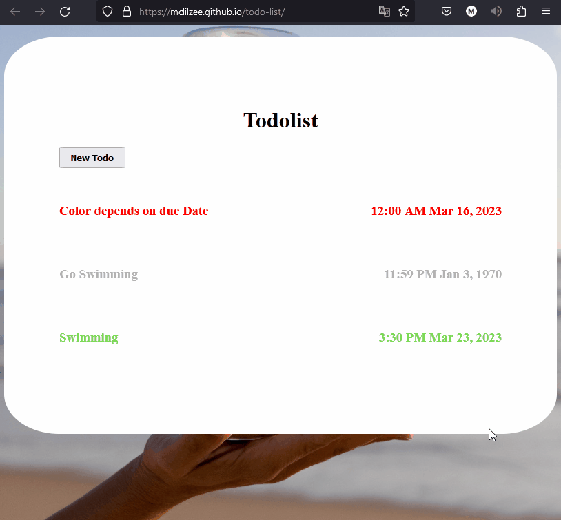

# <a href="https://mclilzee.github.io/todo-list">Todolist Application</a>
Todolist is one of the main tools that we have created to keep track of what we need to do in our day to day life.

This application bring it to the web, a very simple elegant todo-list tracker that will keep track of your todos, marking them automatically as time goes by.
Red when its almost due, Yellow when its due tomorrow and grey if time already passed.

# Examples

### Adding Todo Item

### Removing Todo Item

### Toggle Active status

### Edit Date

### Edit Information

# Credit

### Background Photo
<a href="https://unsplash.com/@pguerreiro?utm_source=unsplash&utm_medium=referral&utm_content=creditCopyText">Paula Guerreiro</a> on <a href="https://unsplash.com/s/photos/hourglass?utm_source=unsplash&utm_medium=referral&utm_content=creditCopyText">Unsplash</a>
